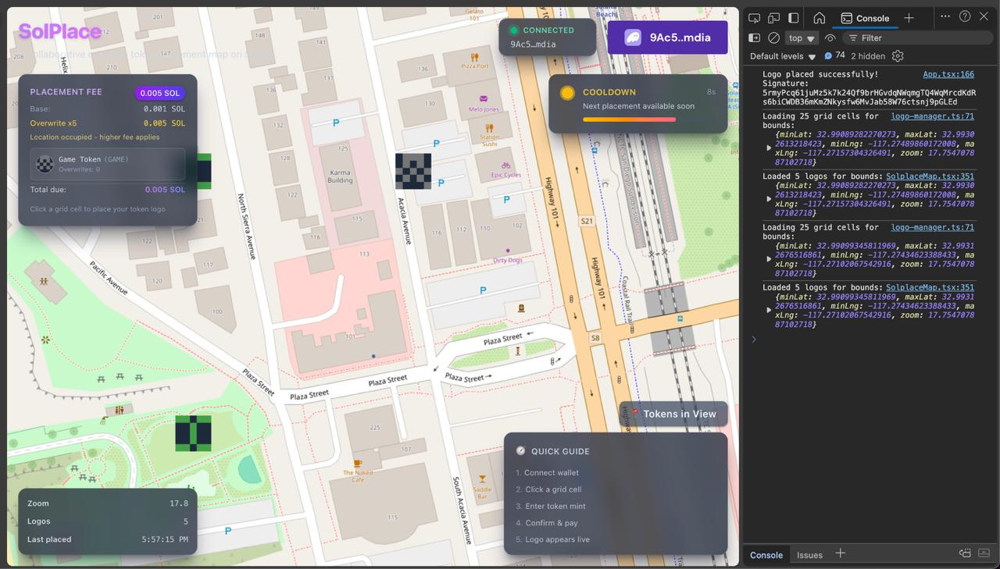
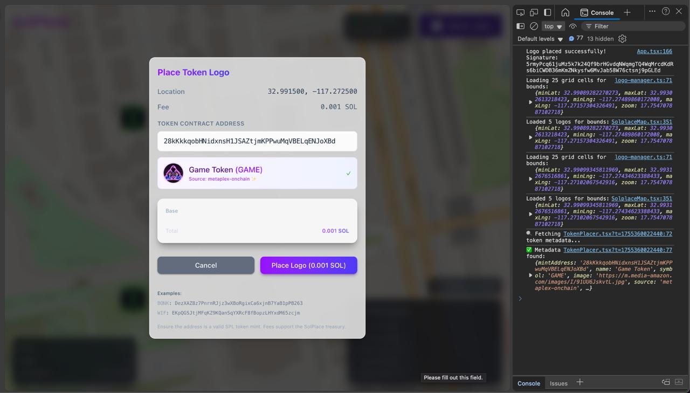

# SolPlace

**The collaborative token map on Solana.** Plant your token's flag anywhere on Earth.

Think Reddit's r/Place, but for Solana tokens on a real world map. Communities compete for territory, meme coins battle for landmarks, and the entire ecosystem fights for visibility — all on-chain.




## How It Works

1. **Connect** your Solana wallet
2. **Navigate** the world map and pick a location
3. **Enter** any Solana token address
4. **Pay** a small fee in SOL
5. **Watch** your token's logo appear on the map



Someone placed BONK on Times Square? Overwrite it with WIF for 5x the fee. Territory wars are encouraged.

## Why SolPlace?

Every token community wants visibility. SolPlace turns that into a game.

- **Meme coins** battle for iconic landmarks — the Eiffel Tower, the Colosseum, Mount Fuji
- **DeFi protocols** claim financial districts — Wall Street, the City of London, Singapore
- **New launches** grab unclaimed territory to get noticed
- **Communities** coordinate to paint entire regions in their colors

It's marketing, it's community building, it's on-chain PvP — all in one.

## Features

**For token communities:**
- Claim territory and show dominance on the global map
- Defend your spots or raid competitors
- Rally your community for coordinated takeovers

**For explorers:**
- Discover new tokens by browsing the map
- See which communities are most active
- Find hidden gems in unexpected places

**On-chain guarantees:**
- Every placement is a Solana transaction
- No backend, no database — just the blockchain
- Verifiable history of who placed what, when

## The Game

The map starts empty. Early movers claim prime real estate cheap.

As spots fill up, competition heats up. Want that landmark? Pay 5x what the last person paid. They lose their spot, you take it. They can take it back — for 5x what you paid.

Prices escalate. Communities mobilize. Alliances form. Memes are made.

30-second cooldown per wallet keeps it fair. No bots spamming placements.

## Try It Yourself

### Prerequisites

- [Node.js](https://nodejs.org/) 18+
- [pnpm](https://pnpm.io/) (`npm install -g pnpm`)
- [Rust](https://rustup.rs/) (for program development)
- [Solana CLI](https://docs.solana.com/cli/install-solana-cli-tools)
- [Anchor](https://www.anchor-lang.com/docs/installation) 0.31+

### Quick Start

```bash
# Clone and install
git clone https://github.com/your-username/solplace.git
cd solplace
pnpm install

# Start the frontend
pnpm dev
```

Open http://localhost:5173 and connect a Solana wallet (Phantom, Solflare, etc.).

### Testing the Solana Program

The on-chain program runs on **devnet**. To run the full test suite:

```bash
# 1. Configure Solana for devnet
solana config set --url devnet

# 2. Create a wallet if you don't have one
solana-keygen new --outfile ~/.config/solana/id.json

# 3. Get devnet SOL (free)
solana airdrop 2

# 4. Build the program
cd packages/program
pnpm build

# 5. Run the tests
pnpm test
```

Tests cover logo placement, overwriting, cooldowns, and fee calculations.

### Testing with a Local Validator

For faster iteration without hitting devnet:

```bash
# Terminal 1: Start local validator
solana-test-validator

# Terminal 2: Configure for localhost
solana config set --url localhost
solana airdrop 5

# Terminal 3: Deploy and test
cd packages/program
anchor build
anchor deploy
pnpm test
```

### Testing the Frontend

```bash
cd packages/web
pnpm dev      # Start dev server
pnpm lint     # Check for issues
pnpm build    # Production build
```

### Testing the Shared Library

```bash
cd packages/shared
pnpm test        # Run Jest tests
pnpm type-check  # TypeScript validation
```

## Project Structure

```
solplace/
├── packages/
│   ├── program/     # Solana program (Anchor/Rust)
│   ├── web/         # React frontend (Vite)
│   └── shared/      # TypeScript client library
└── docs/            # Architecture & design docs
```

## Key Concepts

| Concept | Description |
|---------|-------------|
| **Grid Cells** | The world is divided into cells. Each cell holds one token logo. |
| **Placement Fee** | 0.001 SOL for empty cells, 5x for overwrites |
| **Cooldown** | 30 seconds between placements per user |
| **Logo Resolution** | Fetches logos from Metaplex, Pump.fun, Jupiter, DexScreener |

## Tech Stack

- **Blockchain**: Solana + Anchor framework
- **Frontend**: React 19, Zustand, MapLibre GL, Tailwind CSS
- **Build**: Vite, pnpm workspaces, TypeScript

## Development Commands

```bash
# Root (all packages)
pnpm dev          # Start everything
pnpm build        # Build everything
pnpm test         # Test everything

# Program only
pnpm --filter program build
pnpm --filter program test
pnpm --filter program deploy

# Web only
pnpm --filter web dev
pnpm --filter web build
```

## Environment Setup

Create `packages/web/.env`:

```env
VITE_RPC_ENDPOINT=https://api.devnet.solana.com
VITE_SOLPLACE_PROGRAM_ID=<your-deployed-program-id>
```

## Contributing

1. Fork the repo
2. Create a feature branch
3. Make your changes
4. Run tests: `pnpm test`
5. Submit a PR

## License

MIT
